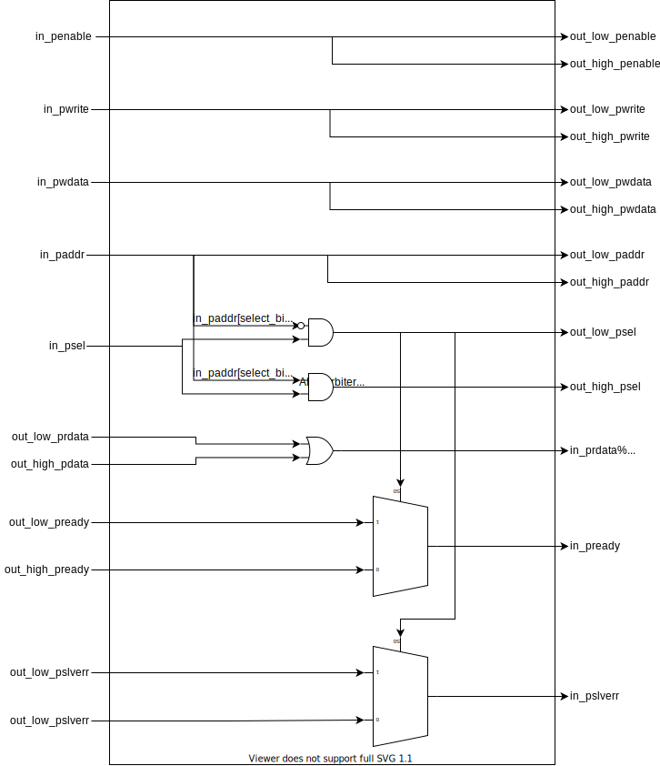
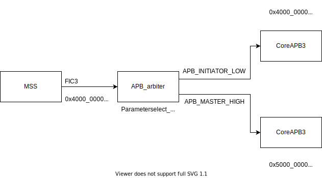

# APB Arbiter readme

## Introduction

The APB arbiter core is used to split a single APB initiator interface into a low initiator and a high initiator depending on a pre determined address bit.

## Ports

The APB arbiter has a single APB target interface and 2 APB initiator interfaces.

### APB Interfaces

The following table describes the ports that are used in the APB interfaces:

| Signal           | Width | Direction | Description                                                  |
|:-----------------|:------|:----------|:-------------------------------------------------------------|
| pclk             | 1     | Input     | Clock source for the peripheral                              |
| presetn          | 1     | Input     | Active high reset for the peripheral                         |
|                  |       |           |                                                              |
| in_penable       | 1     | Input     | Indicates a transaction has begun                            |
| in_psel          | 1     | Input     | Indicates this target has been selected                      |
| in_paddr         | 32    | Input     | Address selected                                             |
| in_pwrite        | 1     | Input     | If high indicates the transaction is a write, otherwise read |
| in_pwdata        | 32    | Input     | Data to be written to the peripheral                         |
| in_prdata        | 32    | Output    | Data read from the peripheral                                |
| in_pready        | 1     | Output    | Indicates a successful transaction                           |
| in_pslverr       | 1     | Output    | If high, indicates an error has occurred                     |
|                  |       |           |                                                              |
| out_low_penable  | 1     | Output    | Indicates a transaction has begun                            |
| out_low_psel     | 1     | Output    | Indicates this target has been selected                      |
| out_low_paddr    | 32    | Output    | Address selected                                             |
| out_low_pwrite   | 1     | Output    | If high indicates the transaction is a write, otherwise read |
| out_low_pwdata   | 32    | Output    | Data to be written to the peripheral                         |
| out_low_prdata   | 32    | Input     | Data read from the peripheral                                |
| out_low_pready   | 1     | Input     | Indicates a successful transaction                           |
| out_low_pslverr  | 1     | Input     | If high, indicates an error has occurred                     |
|                  |       |           |                                                              |
| out_high_penable | 1     | Output    | Indicates a transaction has begun                            |
| out_high_psel    | 1     | Output    | Indicates this target has been selected                      |
| out_high_paddr   | 32    | Output    | Address selected                                             |
| out_high_pwrite  | 1     | Output    | If high indicates the transaction is a write, otherwise read |
| out_high_pwdata  | 32    | Output    | Data to be written to the peripheral                         |
| out_high_prdata  | 32    | Input     | Data read from the peripheral                                |
| out_high_pready  | 1     | Input     | Indicates a successful transaction                           |
| out_high_pslverr | 1     | Input     | If high, indicates an error has occurred                     |

## Design

The APB arbiter takes a single APB initiator interface as an input and splits it into 2 APB initiator outputs. This is achieved by choosing an address bit as a select, when this bit is low the "low" range will be accessible, when the bit is high the "high" range will be accessible. This is done by anding the select bit of paddr with psel for the high range and anding the inverted select bit of paddr with psel to generate the low range. The output psel for the low range is used to drive muxes for pready and pslverr signals going back to the target interface.

## System integration

The APB arbiter is usually converted to be a HDL+ core when imported into Libero SoC, this allows BIFs (Bus Interfaces) to be added which collect all AMBA signals for a particular interface into one port for easier interaction and connection using SmartDesigns. The core can be connected to an APB initiator as shown below, multiple arbiters can be used to further break up address ranges:

