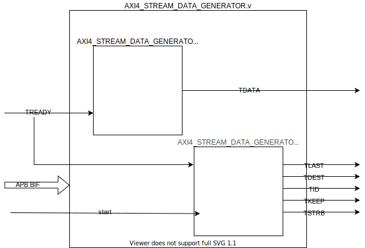

# AXI4 Stream Data Generator Readme

## Introduction
The AXI4_STREAM_DATA_GENERATOR module generates incrementing data which is output over an AXI4 Stream interface. The data is used in transfers as part of a AXI4 Stream transaction.

## Ports

### AMBA AXI4 Stream interface signals

The following table describes the ports that are used in the AXI4 Stream interface:

| Signal  | Width | Direction | Description                                                   |
|:--------|:------|:----------|:--------------------------------------------------------------|
| TVALID    |   1   |   Output  |   TVALID indicates that the master is driving a valid transfer. |
| TREADY    |   1   |   Input   |   TREADY indicates that the slave can accept a transfer in the current cycle.  |
| TDATA     |   32  |   Output  |   TDATA is the primary payload that is used to provide the data that is passing across the interface.   |
| TSTRB     |   32  |   Output  |   Each bit of TSTRB mirrors TKEEP.
| TKEEP     |   4   |   Output  |   Asserting TKEEP is used to indicate a transaction of data bytes, de asserting TKEEP indicates a transaction of null bytes.
| TLAST     |   1   |   Output  |   TLAST indicates the boundary of a packet.   |
| TID       |   8   |   Output  |   The identifier that indicates different streams of data.    |
| TDEST     |   2   |   Output  |   Provides routing information for the data stream.   |

### APB target interface

The following table describes the ports that are used in the APB interface:

| Signal  | Width | Direction | Description                                                   |
|:--------|:------|:----------|:--------------------------------------------------------------|
| penable | 1     | Input     | Indicates a transaction has begun.                            |
| psel    | 1     | Input     | Indicates this target has been selected.                       |
| paddr   | 32    | Input     | Address selected.                                              |
| pwrite  | 1     | Input     | If high indicates the transaction is a write, otherwise read. |
| prdata  | 32    | Output    | Data read from the peripheral.                                 |
| pready  | 1     | Output    | Indicates a successful transaction.                            |
| pwdata  | 32    | Input     | Input used to set the transfer size.                          |
| pslverr | 1     | Output    | Always 0, if high, indicates an error has occurred.            |

### Misc

The following table describes the remaining ports:

| Signal  | Width | Direction | Description                                                   |
|:--------|:------|:----------|:--------------------------------------------------------------|
| ACLK      |   1   |   Input   |   Primary clock signal, all signal are sampled on a rising edge.   |
| RSTN      |   1   |   Input   |   Primary reset signal, active low.        |
| pclk    | 1     | Input     | Clock signal for APB interface exclusively.
| presetn | 1     | Input     | Active high reset signal for APB interface exclusively.                         |
| start     |   1   |   Input   |   Signal to initiate an AXI4 Stream transfer.   |

## Register Description

| Register 	| Offset 	| Width 	| R/W 	| Reset value 	| Description                                                                         	|
|----------	|--------	|-------	|-----	|-------------	|-------------------------------------------------------------------------------------	|
| tx_size_reg  	|   0x0 |   32      | R/W  	| 0x0         	|   Sets the number of transfers in a AXI4 stream transaction.                    |

## Design

The stream transaction generation block is comprised of 2 sub-modules `AXI4_STREAM_DATA_GENERATOR_gen.v` and `AXI4_STREAM_DATA_GENERATOR_control.v`.
`AXI4_STREAM_DATA_GENERATOR_gen.v` generates a stream of incrementing sequential numbers. `AXI4_STREAM_DATA_GENERATOR_control.v` manages the control signals used for addressing and to signal the beginning and end of transfers.

## System integration

This core is usually converted to be a HDL+ core when imported into Libero SoC, this allows BIFs (Bus Interfaces) to be added which collect all AMBA signals for a particular interface into one port for easier interaction and connection using SmartDesigns. The module is intended to be connected via an AXI4 Stream interface to a CoreAXI4DMAController. The module's output will generate incrementing data to benchmark the performance of the system.