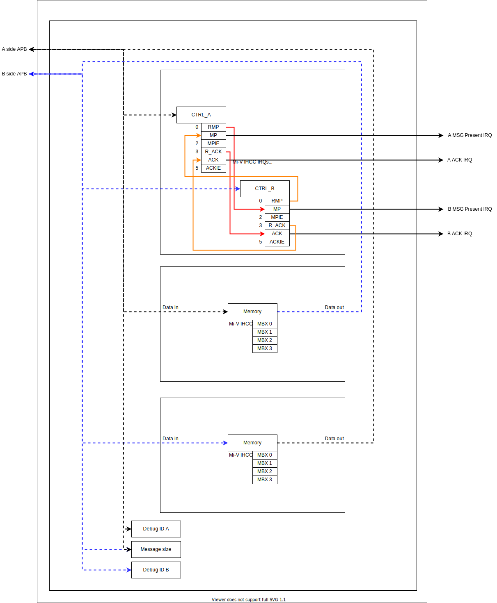
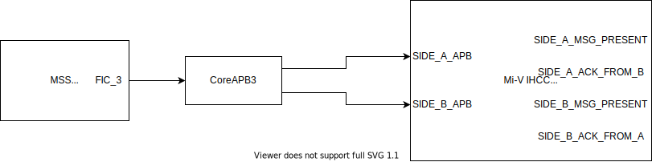
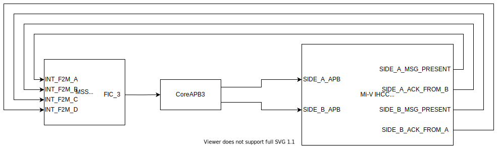

# Mi-V Inter Hart Communication Channel (IHCC) readme

## Introduction

The Mi-V IHCC is used to pass messages and act as a signaling mechanism between two harts in an embedded system. Two APB target ports are provided for access to hart A and hart B registers. The Mi-V IHCC provides interrupt generation and up to four 32 bit message registers to send messages from A -> B and four 32 bit registers to send messages from B -> A.

## Ports

The Mi-V IHCC has 2 APB target interfaces for register access and 4 interrupt outputs.

### APB target Interfaces

The following table describes the ports that are used in the APB interfaces:

| Signal    | Width | Direction | Description                                                             |
|:----------|:------|:----------|:------------------------------------------------------------------------|
| pclk      | 1     | Input     | Clock source for the peripheral                                         |
| presetn   | 1     | Input     | Active high reset for the peripheral                                    |
| a_penable | 1     | Input     | Indicates a transaction has begun on side A                             |
| a_psel    | 1     | Input     | Indicates this target has been selected on side A                       |
| a_paddr   | 5     | Input     | Address selected on side A                                              |
| a_pwrite  | 1     | Input     | If high indicates the transaction is a write, otherwise read. on side A |
| a_pwdata  | 32    | Input     | Data to be written to the peripheral on side A                          |
| a_prdata  | 32    | Output    | Data read from the peripheral on side A                                 |
| a_pready  | 1     | Output    | Indicates a successful transaction on side A                            |
| a_pslverr | 1     | Output    | Always 0, if high, indicates an error has occurred on side A            |
| b_penable | 1     | Input     | Indicates a transaction has begun on side B                             |
| b_psel    | 1     | Input     | Indicates this target has been selected on side B                       |
| b_paddr   | 5     | Input     | Address selected on side B                                              |
| b_pwrite  | 1     | Input     | If high indicates the transaction is a write, otherwise read on side B  |
| b_pwdata  | 32    | Input     | Data to be written to the peripheral on side B                          |
| b_prdata  | 32    | Output    | Data read from the peripheral on side B                                 |
| b_pready  | 1     | Output    | Indicates a successful transaction on side B                            |
| b_pslverr | 1     | Output    | Always 0, if high, indicates an error has occurred on side B            |

### Interrupts

The following table describes the remaining ports:

| Signal             | Width | Direction | Description                                              |
|:-------------------|:------|:----------|:---------------------------------------------------------|
| SIDE_A_MSG_PRESENT | 1     | Output    | Indicates a message present in channel A                 |
| SIDE_A_ACK_FROM_B  | 1     | Output    | Indicates an acknowledge interrupt was sent on channel A |
| SIDE_B_MSG_PRESENT | 1     | Output    | Indicates a message present in channel B                 |
| SIDE_B_ACK_FROM_A  | 1     | Output    | Indicates an acknowledge interrupt was sent on channel B |

## Register Description

### Side A

| Register      | Offset | Width | R/W | Reset value | Description                                                                  |
|:--------------|:-------|:------|:----|:------------|:-----------------------------------------------------------------------------|
| Version       | 0x0    | 32    | RO  | 0x1         | Indicates the version of the core                                            |
| Control       | 0x4    | 32    | R/W | 0x3FF       | Used to enable / disable interrupts and set the ACK interrupt - see below    |
| Debug ID A    | 0x8    | 32    | RO  | Hart ID     | A parameter set to indicate which hart should be connected to this interface |
| Message size  | 0x4    | 32    | RO  | Depth       | Indicates the number of message in registers available (between 1 and 4)     |
| Message in 0  | 0x10   | 32    | RO  | 0x0         | Message B -> A register                                                      |
| Message in 1  | 0x14   | 32    | RO  | 0x0         | Message B -> A register                                                      |
| Message in 2  | 0x18   | 32    | RO  | 0x0         | Message B -> A register                                                      |
| Message in 3  | 0x1C   | 32    | RO  | 0x0         | Message B -> A register                                                      |
| Message out 0 | 0x20   | 32    | WO  | 0x0         | Message A -> B register                                                      |
| Message out 1 | 0x24   | 32    | WO  | 0x0         | Message A -> B register                                                      |
| Message out 2 | 0x28   | 32    | WO  | 0x0         | Message A -> B register                                                      |
| Message out 3 | 0x2C   | 32    | WO  | 0x0         | Message A -> B register                                                      |

### Side B

| Register      | Offset | Width | R/W | Reset value | Description                                                                  |
|:--------------|:-------|:------|:----|:------------|:-----------------------------------------------------------------------------|
| Version       | 0x0    | 32    | RO  | 0x1         | Indicates the version of the core                                            |
| Control       | 0x4    | 32    | R/W | 0x3FF       | Used to enable / disable interrupts and set the ACK interrupt - see below    |
| Debug ID B    | 0x8    | 32    | RO  | Hart ID     | A parameter set to indicate which hart should be connected to this interface |
| Message size  | 0x4    | 32    | RO  | Depth       | Indicates the number of message in registers available (between 1 and 4)     |
| Message in 0  | 0x10   | 32    | RO  | 0x0         | Message A -> B register                                                      |
| Message in 1  | 0x14   | 32    | RO  | 0x0         | Message A -> B register                                                      |
| Message in 2  | 0x18   | 32    | RO  | 0x0         | Message A -> B register                                                      |
| Message in 3  | 0x1C   | 32    | RO  | 0x0         | Message A -> B register                                                      |
| Message out 0 | 0x20   | 32    | WO  | 0x0         | Message B -> A register                                                      |
| Message out 1 | 0x24   | 32    | WO  | 0x0         | Message B -> A register                                                      |
| Message out 2 | 0x28   | 32    | WO  | 0x0         | Message B -> A register                                                      |
| Message out 3 | 0x2C   | 32    | WO  | 0x0         | Message B -> A register                                                      |

### Version register

| Bit(s) | Name       | Reset value | Description                                                                   |
|:-------|:-----------|:------------|:------------------------------------------------------------------------------|
| 31:0   | IP Version | 1           | Contains the current core IP version. This can be used to check compatibility |

### Control register

| Bit(s) | Name                   | Reset value | Description                                                                                                      |
|:-------|:-----------------------|:------------|:-----------------------------------------------------------------------------------------------------------------|
| 0      | Remote Message Present | 0           | This bit is mirrored to the other side's MP. Setting this bit sends a message present IRQ to the receiving hart. |
| 1      | Message Present        | 0           | When set this bit indicates a message has been sent to this hart. This bit is cleared by writing 0.              |
| 2      | Message Present IRQ EN | 0           | Setting this bit allows the message present bit to assert the SIDE_X_MSG_PRESENT output when set.                |
| 3      | Remote acknowledge     | 0           | This bit is mirrored to the other side's ACK. Setting this bit sends an acknowledge IRQ to the sending hart.     |
| 4      | Acknowledge            | 0           | When set this bit indicates a message has been received and acknowledged by the other side.                      |
| 5      | Acknowledge IRQ EN     | 0           | Setting this bit allows the acknowledge bit to assert the SIDE_X_ACK_FROM_Y output when set.                     |

### Debug ID register

| Bit(s) | Name     | Reset value | Description                                                                                                                              |
|:-------|:---------|:------------|:-----------------------------------------------------------------------------------------------------------------------------------------|
| 31:0   | Debug ID | Debug ID    | The value of this register is set by a parameter which should indicate which hart is connected to the interface accessing this register. |

### Message size register

| Bit(s) | Name         | Reset value  | Description                                                                                                                                |
|:-------|:-------------|:-------------|:-------------------------------------------------------------------------------------------------------------------------------------------|
| 31:0   | Message size | Message size | The value of this register is set by a parameter which should indicate which the number of message in and message out registers available. |

### Message in X registers

| Bit(s) | Name         | Reset value | Description                                                                                                                  |
|:-------|:-------------|:------------|:-----------------------------------------------------------------------------------------------------------------------------|
| 31:0   | Message in x | 0           | These are read only registers used to receive messages. The number of registers available depends on the core configuration. |

### Message out X registers

| Bit(s) | Name          | Reset value | Description                                                                                                                |
|:-------|:--------------|:------------|:---------------------------------------------------------------------------------------------------------------------------|
| 31:0   | Message out x | 0           | These are write only registers used to send messages. The number of registers available depends on the core configuration. |

## Design

The Mi-V IHCC has 2 main components, interrupt generation and memory. As the core can be used in a polled or interrupt driven configuration. Interrupts can be enabled / disabled as required by writing to the control register. The core is broken into two sides (A and B) and each side has its own set of control registers and mailboxes. Each mailbox can be written to by one side and read by the other, no mailbox is R/W from a single side.

## System integration

### Polled configuration

To use the Mi-V IHCC without interrupts only the A and B side APB interfaces need to be connected as shown in the diagram below:

### Interrupt configuration

This core is usually converted to be a HDL+ core when imported into Libero SoC, this allows BIFs (Bus Interfaces) to be added which collect all AMBA signals for a particular interface into one port for easier interaction and connection using SmartDesigns. To use the Mi-V IHCC in an interrupt driven configuration the A and B side APB interfaces need to be connected along with the interrupt outputs as shown below (note: the Mi-V IHCIA can be used to reduce interrupt overhead with the Mi-V IHCC):

