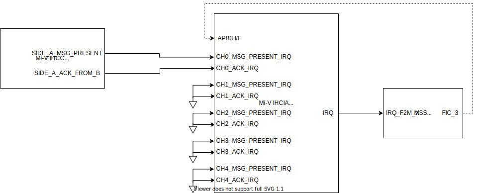

# Mi-V Inter Hart Communication Interrupt Aggregator (IHCIA) readme

## Introduction

The Mi-V IHCIA is used to as an interrupt controller to consolidate interrupts generated by a Mi-V IHCC component. It has an APB interface for register access and several interrupt inputs which are consolidated into a single interrupt output. Each interrupt input has a dedicated enable bit in a control register to allow interrupt driven or polled operation of the core.

## Ports

The Mi-V IHCIA features an APB target interface for register access, 8 interrupt inputs and 1 interrupt output.

### APB target Interface

The following table describes the ports that are used in the APB interface:

| Signal  | Width | Direction | Description                                                   |
|:--------|:------|:----------|:--------------------------------------------------------------|
| pclk    | 1     | Input     | Clock source for the peripheral                               |
| presetn | 1     | Input     | Active high reset for the peripheral                          |
| penable | 1     | Input     | Indicates a transaction has begun                             |
| psel    | 1     | Input     | Indicates this target has been selected                       |
| paddr   | 4     | Input     | Address selected                                              |
| pwrite  | 1     | Input     | If high indicates the transaction is a write, otherwise read. |
| pwdata  | 10    | Input     | Data to be written to the peripheral                          |
| prdata  | 10    | Output    | Data read from the peripheral                                 |
| pready  | 1     | Output    | Indicates a successful transaction                            |
| pslverr | 1     | Output    | Always 0, if high, indicates an error has occurred            |

### Interrupts

The following table describes the remaining ports:

| Signal                  | Width | Direction | Description                                                         |
|:------------------------|:------|:----------|:--------------------------------------------------------------------|
| CH[0:4]_MSG_PRESENT_IRQ | 1     | Input     | Indicates a message present in channel x                            |
| CH[0:4]_ACK_IRQ         | 1     | Input     | Indicates an acknowledge interrupt was sent on channel x            |
| IRQ                     | 1     | Output    | Asserts to indicate an input above has asserted while being enabled |

## Register Description

| Register | Offset | Width | R/W | Reset value | Description                                                                         |
|:---------|:-------|:------|:----|:------------|:------------------------------------------------------------------------------------|
| Version  | 0x0    | 32    | RO  | 0x1         | Indicates the version of the core                                                   |
| Control  | 0x4    | 10    | R/W | 0x3FF       | Used to enable / disable interrupt inputs from asserting the IRQ output - see below |
| Status   | 0x8    | 10    | RO  | 0x0         | Indicates the state of the interrupt inputs - see below                             |

### Control register

| Bit | Name                    | Reset value | Description                                                                  |
|:----|:------------------------|:------------|:-----------------------------------------------------------------------------|
| 0   | CH_0_MSG_PRESENT_IRQ_EN | 1           | Enables the message present irq input for channel 0 to assert the IRQ output |
| 1   | CH_0_ACK_IRQ_EN         | 1           | Enables the acknowledge irq input for channel 0 to assert the IRQ output     |
| 2   | CH_1_MSG_PRESENT_IRQ_EN | 1           | Enables the message present irq input for channel 1 to assert the IRQ output |
| 3   | CH_1_ACK_IRQ_EN         | 1           | Enables the acknowledge irq input for channel 1 to assert the IRQ output     |
| 4   | CH_2_MSG_PRESENT_IRQ_EN | 1           | Enables the message present irq input for channel 2 to assert the IRQ output |
| 5   | CH_2_ACK_IRQ_EN         | 1           | Enables the acknowledge irq input for channel 2 to assert the IRQ output     |
| 6   | CH_3_MSG_PRESENT_IRQ_EN | 1           | Enables the message present irq input for channel 3 to assert the IRQ output |
| 7   | CH_3_ACK_IRQ_EN         | 1           | Enables the acknowledge irq input for channel 3 to assert the IRQ output     |
| 8   | CH_4_MSG_PRESENT_IRQ_EN | 1           | Enables the message present irq input for channel 4 to assert the IRQ output |
| 9   | CH_4_ACK_IRQ_EN         | 1           | Enables the acknowledge irq input for channel 4 to assert the IRQ output     |

### Status register

| Bit | Name                 | Reset value | Description                                                  |
|:----|:---------------------|:------------|:-------------------------------------------------------------|
| 0   | CH_0_MSG_PRESENT_IRQ | 0           | Current state of the message present irq input for channel 0 |
| 1   | CH_0_ACK_IRQ         | 0           | Current state of the acknowledge irq input for channel 0     |
| 2   | CH_1_MSG_PRESENT_IRQ | 0           | Current state of the message present irq input for channel 1 |
| 3   | CH_1_ACK_IRQ         | 0           | Current state of the acknowledge irq input for channel 1     |
| 4   | CH_2_MSG_PRESENT_IRQ | 0           | Current state of the message present irq input for channel 2 |
| 5   | CH_2_ACK_IRQ         | 0           | Current state of the acknowledge irq input for channel 2     |
| 6   | CH_3_MSG_PRESENT_IRQ | 1           | Current state of the message present irq input for channel 3 |
| 7   | CH_3_ACK_IRQ         | 1           | Current state of the acknowledge irq input for channel 3     |
| 8   | CH_4_MSG_PRESENT_IRQ | 1           | Current state of the message present irq input for channel 4 |
| 9   | CH_4_ACK_IRQ         | 1           | Current state of the acknowledge irq input for channel 4     |

## Design

The IHCIA has two main registers, the control and status registers. The control register contains the enables for each interrupt causing bit in the status register. Each bit in the status register is driven by an input which correlates to an IRQ present or an ACK on a channel.

The diagram above shows the base implementation with connections for channel 0 shown, all other channels drive inputs to the OR gate driving the IRQ output.

## System integration

This core is usually converted to be a HDL+ core when imported into Libero SoC, this allows BIFs (Bus Interfaces) to be added which collect all AMBA signals for a particular interface into one port for easier interaction and connection using SmartDesigns. A Mi-V IHCIA core can be used with up to 5 Mi-V IHC channels. A basic configuration with one connected channel is shown below. Note all unused channels are tied to ground.

