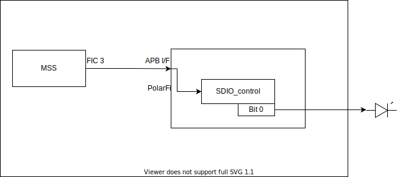

# SDIO register readme

## Introduction

The SDIO register is a single bit register which provides a memory mapped bit which can be set / unset and used to drive FPGA fabric logic or a top level I/O pin. The register is controlled using an APB interface. This core was initially designed to drive the SDIO_SW_SEL[1:0] pins on an Icicle Kit but it can be used to drive other logic.

## Ports

### APB target interface

The following table describes the ports that are used in the APB interface:

| Signal  	| Width 	| Direction 	| Description                                                   	|
|---------	|-------	|-----------	|---------------------------------------------------------------	|
| pclk    	| 1     	| Input     	| Clock source for the peripheral                               	|
| presetn 	| 1     	| Input     	| Active high reset for the peripheral                          	|
| penable 	| 1     	| Input     	| Indicates a transaction has begun                             	|
| psel    	| 1     	| Input     	| Indicates this target has been selected                       	|
| paddr   	| 32    	| Input     	| Address selected                                              	|
| pwrite  	| 1     	| Input     	| If high indicates the transaction is a write, otherwise read. 	|
| pwdata  	| 32    	| Input     	| Data to be written to the peripheral                          	|
| prdata  	| 32    	| Output    	| Data read from the peripheral                                 	|
| pready  	| 1     	| Output    	| Indicates a successful transaction                            	|
| pslverr 	| 1     	| Output    	| Always 0, if high, indicates an error has occurred            	|

### Misc

The following table describes the remaining ports:

| Signal                  	| Width 	| Direction 	| Description                                                             	|
|-------------------------	|-------	|-----------	|-------------------------------------------------------------------------	|
| SDIO_control             	| 1     	| Output     	| This bit mirrors the internal register bit that can be set and cleared   	|

## Register Description

| Register 	      | Offset 	| Width 	| R/W 	| Reset value 	| Description                                                                         	|
|----------	      |--------	|-------	|-----	|-------------	|-------------------------------------------------------------------------------------	|
| SDIO_control  	| 0x0    	| 1     	| R/W  	| 0x0         	| Register bit that can be set and cleared                                             	|

## Design

The SDIO register has a simple design, a single register bit at offset 0x0 can be accessed using the APB target interface of the core. Internally the register bit is brought out as a top level output.

## System integration

This core is usually converted to be a HDL+ core when imported into Libero SoC, this allows BIFs (Bus Interfaces) to be added which collect all AMBA signals for a particular interface into one port for easier interaction and connection using SmartDesigns. The SDIO register can be connected to an APB bus, the output of the register can be used to drive fabric logic within the FPGA or external components as shown below:

